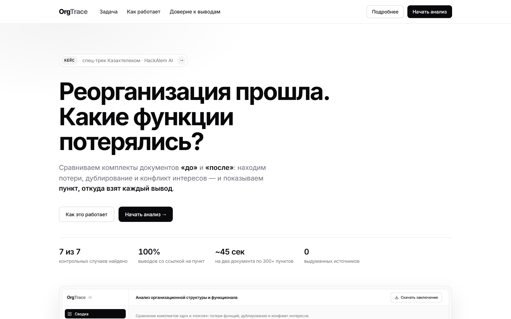
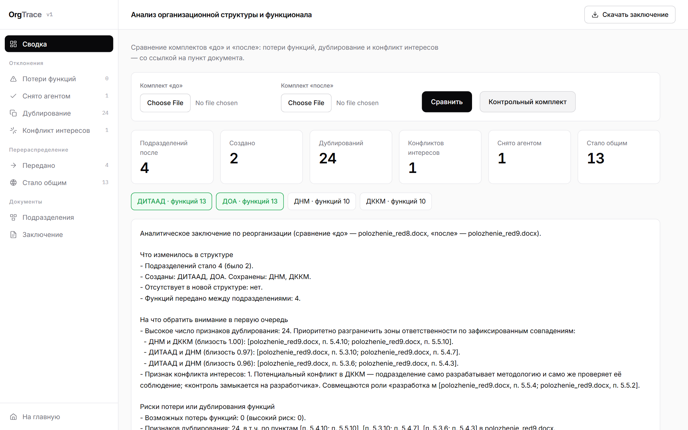
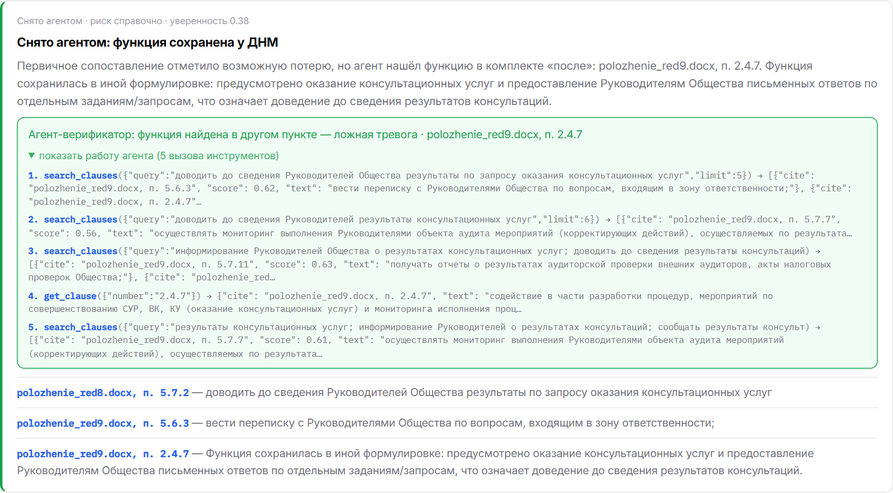
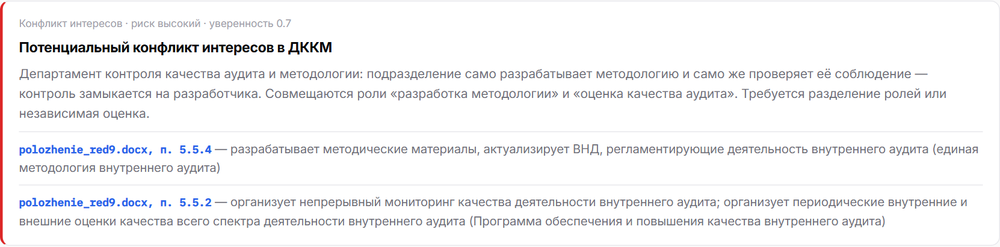
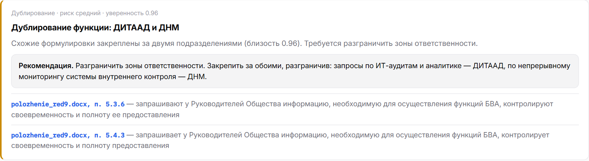
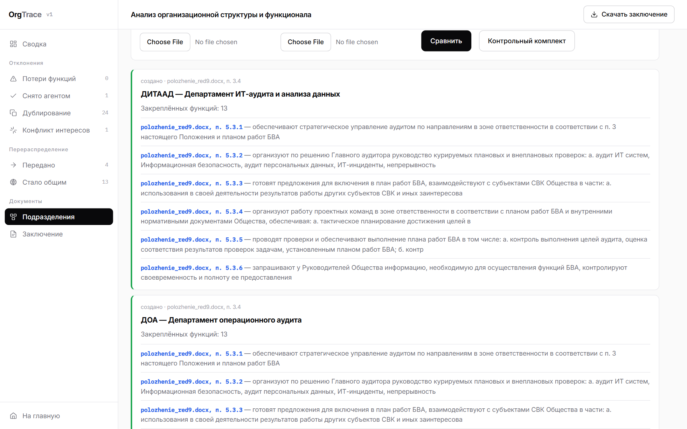

# OrgTrace

**Трассировка функций при реорганизации.** ИИ-агент «Анализ организационной структуры и функционала».

Агент сравнивает комплекты организационных документов «до» и «после» реорганизации, находит потерю функций, дублирование и конфликт интересов и формирует заключение, **где каждый вывод сопровождается ссылкой на конкретный пункт документа**.

**Задача:** спец-трек Казахтелеком — ИИ-агент «Анализ организационной структуры и функционала»
**Команда:** Solnik

---

## Проблема

При реорганизации подразделений положения, оргструктуры и приложения к распорядительным документам сопоставляют вручную. На комплекте из двух редакций одного положения это 84 тысячи знаков и более трёхсот пунктов в каждом документе. Человек читает их построчно, поэтому функции теряются, дублируются и пересекаются незаметно.

## Что делает решение

Пользователь загружает два комплекта документов. Агент разбирает их на пронумерованные пункты, определяет состав подразделений и закреплённые за ними функции, сопоставляет функции семантически и выдаёт:

- перечень созданных, сохранённых и исчезнувших подразделений;
- функции, которым не нашлось соответствия в новой редакции — возможная потеря;
- функции, перешедшие в другое подразделение;
- близкие формулировки у разных подразделений — дублирование;
- признаки конфликта интересов, когда одно подразделение и выполняет проверки, и оценивает их качество;
- итоговое аналитическое заключение.

Для каждого вывода показывается документ, номер пункта и сама цитата.

## Как это выглядит

**Стартовая страница**



**Сводка по разбору контрольного комплекта.** Сайдбар разбит на группы выводов со счётчиками; сверху показатели, ниже состав подразделений (созданные выделены), итоговое заключение и карточки выводов.



**Работа агента-верификатора.** Первичное сопоставление отметило возможную потерю функции. Агент пять раз обратился к документу, нашёл функцию в новой формулировке в п. 2.4.7 и снял ложную тревогу. Раскрывающийся блок показывает каждый вызов инструмента с аргументами и ответом.



**Конфликт интересов.** ДККМ одновременно разрабатывает методические материалы и оценивает качество аудита — вывод подтверждён двумя пунктами.



**Рекомендация по устранению дублирования** — опциональный пункт ТЗ.



**Подразделения** с закреплёнными функциями и ссылками на пункты.



Снимки воспроизводятся скриптом `scripts/screenshots.py` при запущенном сервере (нужен Playwright: `pip install playwright && python -m playwright install chromium`).

## Проверить за 60 секунд

```bash
git clone <URL репозитория> && cd <папка>
python -m venv .venv && .venv\Scripts\activate      # Windows
pip install -r requirements.txt

python -m pytest tests -q                           # тесты, сеть не нужна
python -m src.evaluate                              # проверка на контрольном комплекте с метрикой
python -m src.evaluate --fast                       # то же без агента и без сети
python -m uvicorn src.app:app --port 8000           # веб-интерфейс: http://127.0.0.1:8000
```

В интерфейсе нажмите **«Контрольный комплект»** — анализ выполнится на документах из `data/samples`, загружать ничего не нужно. Личные аккаунты для проверки не требуются.

Python 3.10 и выше. `OPENAI_API_KEY` не обязателен: без него агент работает в резервном режиме (см. ниже).

## Контрольный сценарий и что должно найтись

Комплект `data/samples` — две редакции Положения о внутреннем аудите (№8 и №9). Заранее известные изменения и ожидаемый результат:

| Что произошло | Ожидаемый вывод | Подтверждение |
|---|---|---|
| Созданы два департамента | ДИТААД и ДОА помечены как созданные | п. 3.4 обеих редакций |
| Состав вырос с 2 до 4 подразделений | 4 подразделения после, 2 до | п. 3.4 |
| Роль «Директор направления внутреннего аудита» преобразована | функции перешли к директорам ДИТААД и ДОА | ред.8 п. 5.3 → ред.9 п. 5.3 |
| Часть функций ДНМ и ДККМ перераспределена | function_moved между подразделениями | п. 5.4–5.7 обеих редакций |

### Результат прогона `python -m src.evaluate`

```
Найдено контрольных случаев: 7 из 7
Выводов всего: 48
Из них со ссылкой на конкретный пункт: 48 (100%)
```

Разбивка выводов: 24 дублирования, 13 функций, ставших общими, 5 передач между подразделениями, 2 созданных подразделения, 2 сохранённых, 1 конфликт интересов, 1 подозрение на потерю, снятое агентом. Полный разбор двух документов по 300+ пунктов занимает около 45 секунд. Тестов — 34, проходят без сети.

## Архитектура

```
документы .docx
      │
      ▼
docparse.py   разбор на пункты с сохранением номера, раздела и цитаты
      │
      ▼
orgmap.py     состав подразделений (п. «состоит из следующих подразделений»)
              и функции каждого — по подпунктам его руководителя
      │
      ▼
align.py      семантическая близость функций
              режим embeddings (OpenAI) │ резервный lexical (без сети)
      │
      ▼
compare.py    потери, передачи, обобщения, дублирования, конфликты + источники
      │
      ▼
agent.py      агент-верификатор: перепроверяет каждое подозрение на потерю,
              вызывая инструменты search_clauses / get_clause / list_units
      │
      ├──► recommend.py предложения по устранению пересечений функций
      ├──► report.py    заключение (модель переписывает факты, не добавляя своих)
      ├──► export.py    выгрузка заключения в Word
      ├──► evaluate.py  проверка на контрольном комплекте и метрика
      └──► app.py       веб-интерфейс и JSON API
```

**Агентный слой — ядро решения.** Сопоставление по близости даёт кандидатов, но не понимает, что функция могла переехать в другой раздел или быть переформулирована. Поэтому каждое подозрение на потерю проходит второй круг: агент сам решает, что искать, вызывает инструменты поиска по документу и выносит вердикт — «потеря подтверждена», «функция найдена в другом пункте» или честное «не уверен, нужна проверка человеком». В интерфейсе раскрывается полная трассировка его вызовов.

**Агент не может выдумать источник.** Цитаты он получает только из инструментов, а вердикт «функция найдена» без ссылки на пункт отклоняется кодом и понижается до «не уверен».

**Ключевое решение: разделение детерминированного и вероятностного.** Всё, что однозначно задано документом — номер пункта, принадлежность функции подразделению, состав структуры — извлекается кодом. Модель применяется только там, где нужен смысл: сопоставление разных формулировок одной функции и текст заключения. Поэтому агент не может придумать несуществующий пункт: цитата всегда берётся из разобранного документа.

**Порог уверенности.** У каждого вывода есть числовая уверенность. Слабое соответствие помечается средним риском, а не выдаётся за факт. Формулировки намеренно осторожны: «возможная потеря функции», а не «функция утрачена».

**Резервный режим.** Если ключа нет или сеть недоступна, близость считается по взвешенным токенам с IDF, без обращения к сети. Выводы становятся грубее, но продукт остаётся работоспособным — это важно для демонстрации в зале с общим Wi-Fi.

## Соответствие требованиям ТЗ

| Требование (must have) | Где реализовано |
|---|---|
| 1. Определить реорганизованные, сохранённые и созданные подразделения | `compare.compare_units` → `unit_created` / `unit_kept` / `unit_removed` |
| 2. Сопоставить функционал и выявить потерю функций | `compare.compare_functions` → `function_lost`, `function_moved` |
| 3. Выявить дублирование и конфликт интересов | `compare.find_duplication`, `compare.find_conflicts` |
| 4. Для каждого вывода показать источник: документ и пункт | `docparse.Clause.cite`, поле `sources` у каждого вывода |
| 5. Итоговое аналитическое заключение | `report.render_conclusion`, показывается в интерфейсе и выгружается в Word — `export.build_docx`, кнопка «Скачать заключение» |

Пункты раздела «Опционально» из ТЗ:

| Опциональное требование | Состояние |
|---|---|
| 3. Рекомендации по перераспределению функций и устранению пересечений | реализовано: `recommend.py` предлагает, за кем закрепить функцию, с обоснованием |
| 1. Сверка с законодательством и стандартами | не реализовано: корпус нормативных документов подключается тем же парсером |
| 2. Сравнение структур с другими операторами | не реализовано: требует внешних данных |

Дополнительно к требованиям ТЗ: выявление функций, **переставших быть закреплёнными за подразделением** (`function_generalized`) — при реорганизации ответственность нередко размывается в общие разделы, и это отдельный риск; агент-верификатор, снимающий ложные тревоги; скрипт проверки на контрольном комплекте с метрикой.

## Технологии

Python 3.10+, FastAPI и Uvicorn, OpenAI API (`text-embedding-3-small` для близости, чат-модель для заключения), разбор `.docx` через распаковку OOXML без внешних зависимостей, pytest. Интерфейс — одна страница на чистом HTML и JS, без сборки.

## Переменные окружения

Файл `.env.example`:

| Переменная | Назначение |
|---|---|
| `OPENAI_API_KEY` | Ключ OpenAI. Без него — резервный режим |
| `OPENAI_MODEL` | Модель для заключения |
| `OPENAI_EMBED_MODEL` | Модель эмбеддингов, по умолчанию `text-embedding-3-small` |
| `OPENAI_TIMEOUT_S` | Таймаут запроса к OpenAI, по умолчанию 40 секунд |
| `ORGTRACE_OFFLINE` | `1` — полностью без сети, резервный режим |
| `ORGTRACE_<РЕЖИМ>_<ПОРОГ>` | Переопределение порога сходства, например `ORGTRACE_EMBEDDINGS_MATCH=0.6` |

## Сторонние материалы и open-source

| Компонент | Лицензия | Что используется |
|---|---|---|
| FastAPI | MIT | HTTP-слой |
| Uvicorn | BSD-3 | ASGI-сервер |
| openai (python) | Apache-2.0 | Эмбеддинги, агент-верификатор, заключение |
| python-docx | MIT | Выгрузка заключения в Word |
| pytest | MIT | Тесты |

Тестовые документы предоставлены организатором в составе кейса. Заранее подготовленный технический шаблон (каркас проекта, движок правил `src/rules_engine.py` с тестами) создан до начала соревновательной части; вся функциональность анализа организационных документов разработана 23.09.2026 в период с 13:00 до 18:00.

## Ограничения

- Выводы носят рекомендательный характер и требуют проверки ответственным сотрудником.
- Агент не утверждает ничего, что не подтверждено текстом документов: при слабом соответствии он сообщает о низкой уверенности, а не о факте.
- Разбор рассчитан на документы с иерархической нумерацией пунктов. Форматы PDF и Excel подключаются к той же схеме `Clause`, в прототипе реализован `.docx`.
- Правило конфликта интересов в прототипе опирается на совмещение исполнения проверок и контроля их качества; список признаков расширяется таблицей в `compare.CONFLICT_ROLES`.

## Что дальше

Подключение PDF и Excel к существующей схеме пунктов; сверка функций с внешними требованиями и стандартами (опциональный пункт ТЗ) — корпус нормативных документов подключается тем же парсером; бенчмаркинг структуры против других операторов; рекомендации по перераспределению функций. Решение применимо к любой организации, где реорганизация оформляется положениями и приложениями к распорядительным документам, — от оператора связи до государственного органа.

## Надёжность и безопасность

**Проверка входных файлов.** Принимается только Word (.docx); пустой, повреждённый или не-Word файл отклоняется с понятным объяснением. Лимит 20 МБ на файл и 200 МБ после распаковки — .docx является zip-архивом, и без второго лимита небольшой файл мог бы распаковаться в гигабайты. Временные файлы удаляются сразу после разбора.

**Изоляция результатов.** Каждый разбор получает собственный идентификатор; выгрузка заключения возможна только по нему.

**Вывод в браузер.** Весь текст из документов и ответов модели экранируется перед показом, поэтому разметка внутри загруженного файла не выполняется. Имя файла в заголовке ответа очищается от служебных символов.

**Защита агента от подмены источника.** Текст документов передаётся модели как данные, отделённые от инструкций, с прямым указанием игнорировать команды внутри них. Кроме того, это проверяется кодом, а не доверием к модели: вердикт «функция найдена» принимается, только если агент сам получил указанный пункт через инструменты в этой же проверке, а решение без единого обращения к документу отклоняется. Поэтому документ не может заставить агента сослаться на пункт, которого тот не видел.

**Отказоустойчивость.** Анализ выполняется в пуле потоков и не блокирует сервер для других запросов. У обращений к OpenAI таймаут 40 секунд и два повтора; при недоступности сети сервис переходит в резервный режим сопоставления без модели. Векторы пунктов кешируются, поэтому один и тот же текст не отправляется в OpenAI повторно.

**Настройка порогов.** Пороги сходства подобраны на контрольном комплекте — единственном размеченном наборе, и на других документах их может понадобиться подстроить. Каждый порог переопределяется переменной окружения без правки кода, например `ORGTRACE_EMBEDDINGS_MATCH=0.6`. Ошибки порога на стороне потерь дополнительно гасит агент-верификатор.

**Тесты.** 34 теста проходят без сети за секунду (`ORGTRACE_OFFLINE=1` выставляется автоматически): разбор и сопоставление на документах кейса, приём файлов, лимиты, zip-бомба, удаление временных файлов, изоляция выгрузки, очистка имени файла, защиты агента — проверяются поддельным клиентом модели.

Проверено воспроизведение с нуля: клонирование репозитория, установка зависимостей из `requirements.txt` в чистое окружение, запуск тестов и сервера без файла `.env`.
